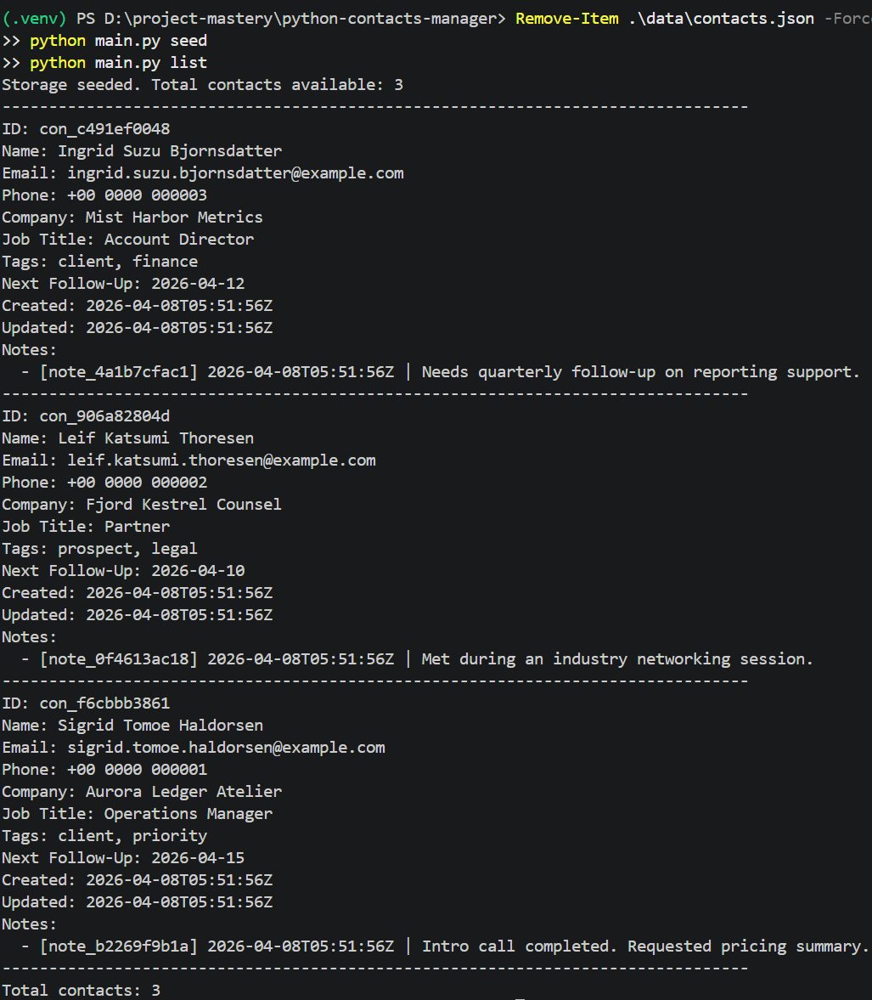
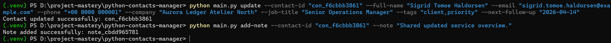
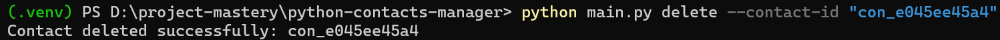
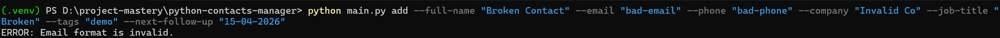
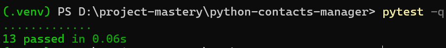

# Python Contacts Manager

Python Contacts Manager is a command-line application for managing professional contacts, notes, tags, and follow-up dates locally. It is designed for small teams or individual operators who need a lightweight contact workflow without the overhead of a full CRM.

## Overview

The application supports:

- creating, updating, listing, searching, and deleting contacts
- preventing duplicate contacts by email and phone
- attaching notes to preserve relationship context
- organizing contacts with tags
- tracking follow-up dates
- storing runtime data locally in JSON
- testing core application behavior with `pytest`

## Problem addressed

Many small teams need a reliable way to manage contacts, follow-ups, and contextual notes, but a spreadsheet is often too fragile and a full CRM can be too heavy for the workflow. This project focuses on a maintainable local solution with clear validation rules, predictable CLI behavior, and a clean separation between input handling, business logic, and persistence.

## Example use cases

This project is suitable for workflows such as:

- consulting teams tracking prospects and clients
- advisory or legal teams maintaining relationship notes
- finance or operations teams following up with external contacts
- solo operators managing outreach and follow-up schedules locally

## Project structure

```text
python-contacts-manager/
│   main.py
│   README.md
│   requirements.txt
│   .gitignore
├── data/
├── docs/
│   ├── case-study/
│   └── screenshots/
├── logs/
├── sql/
├── src/
│   └── contacts_manager/
│       ├── __init__.py
│       ├── cli.py
│       ├── exceptions.py
│       ├── models.py
│       ├── services.py
│       ├── storage.py
│       ├── utils.py
│       └── validation.py
└── tests/
    ├── __init__.py
    ├── test_services.py
    ├── test_storage.py
    └── test_validation.py
```

## Architecture

The application is organized by responsibility:

* `main.py` provides the application entrypoint
* `src/contacts_manager/cli.py` handles command-line parsing and user-facing command execution
* `src/contacts_manager/services.py` contains business rules such as duplicate prevention, searching, note creation, and follow-up filtering
* `src/contacts_manager/validation.py` validates and normalizes user input
* `src/contacts_manager/storage.py` manages JSON-based persistence
* `src/contacts_manager/models.py` defines the contact and note data models
* `src/contacts_manager/exceptions.py` defines application-specific exception types
* `src/contacts_manager/utils.py` contains shared helpers such as logging, timestamps, and ID generation

## Validation rules

The application validates and normalizes:

* required full name values
* email format
* phone format
* follow-up date format using `YYYY-MM-DD`
* note content length
* tag cleanup, normalization, and de-duplication

It also rejects duplicate contacts when an email address or phone number already exists.

## Persistence model

Runtime data is stored locally in:

```text
data/contacts.json
```

This keeps the project simple to run while preserving a clean boundary between storage logic and application logic. The repository also generates runtime logs in:

```text
logs/contacts_manager.log
```

## SQL assets

The application itself runs on JSON storage, but the repository also includes relational SQL artifacts in:

* `sql/schema.sql`
* `sql/queries.sql`

These files show how the same domain can be represented in a relational model, including:

* primary keys
* unique constraints
* foreign keys
* indexing
* CRUD operations
* search queries
* joins across contacts, notes, and tags

## Setup

Run all commands below from:

```powershell
D:\project-mastery\python-contacts-manager
```

### Create and activate the virtual environment

```powershell
py -3 -m venv .venv
.\.venv\Scripts\Activate.ps1
python -m pip install --upgrade pip
pip install -r requirements.txt
```

To exit the virtual environment later:

```powershell
deactivate
```

## Commands

### Show CLI help

```powershell
python main.py --help
```

### Seed demo data

```powershell
python main.py seed
```

### List all contacts

```powershell
python main.py list
```

### Filter contacts by tag

```powershell
python main.py list --tag client
```

### Add a contact

```powershell
python main.py add --full-name "Eirik Nozomi Valdsen" --email "eirik.nozomi.valdsen@example.com" --phone "+00 0000 000004" --company "Pale Summit Works" --job-title "Principal Consultant" --tags "prospect,consulting" --next-follow-up "2026-04-18"
```

### Search contacts

```powershell
python main.py search --query eirik
python main.py search --tag priority
```

### Update a contact

```powershell
python main.py update --contact-id "con_REPLACE_ME" --full-name "Eirik Nozomi Valdsen" --email "eirik.nozomi.valdsen@example.com" --phone "+00 0000 000004" --company "Pale Summit Works" --job-title "Principal Consultant" --tags "prospect,consulting,priority" --next-follow-up "2026-04-14"
```

### Add a note to a contact

```powershell
python main.py add-note --contact-id "con_REPLACE_ME" --note "Requested proposal follow-up after discovery meeting."
```

### List due follow-ups

```powershell
python main.py due-followups --date "2026-04-15"
```

### Delete a contact

```powershell
python main.py delete --contact-id "con_REPLACE_ME"
```

## Testing

Run the test suite with:

```powershell
pytest -q
```

The test suite covers:

* validation behavior
* storage initialization and persistence
* duplicate prevention
* note creation
* delete flow
* due follow-up filtering

If `pytest` or any other command keeps running unexpectedly, press:

```text
CTRL + C
```

## Expected runtime files

After running the application, you should see generated runtime artifacts such as:

* `data/contacts.json`
* `logs/contacts_manager.log`

You can inspect them with:

```powershell
Get-Content .\data\contacts.json
Get-Content .\logs\contacts_manager.log
```

## Screenshots

Store screenshots in:

```text
docs/screenshots/
```

Expected screenshot files:

* `docs/screenshots/01-seed-and-list.png`
* `docs/screenshots/02-search-and-update.png`
* `docs/screenshots/03-delete-and-followups.png`
* `docs/screenshots/04-validation-failure.png`
* `docs/screenshots/05-tests-passing.png`

### Screenshot checklist

1. `01-seed-and-list.png`

   * run `python main.py seed`
   * run `python main.py list`

2. `02-search-and-update.png`

   * run `python main.py search --query sigrid`
   * run an `update` command with a real `contact_id`
   * run `python main.py add-note --contact-id "con_REPLACE_ME" --note "Requested proposal follow-up after discovery meeting."`

3. `03-delete-and-followups.png`

   * run `python main.py due-followups --date "2026-04-15"`
   * run `python main.py delete --contact-id "con_REPLACE_ME"`
   * run `python main.py list`

4. `04-validation-failure.png`

   * run an invalid add command to show validation errors

5. `05-tests-passing.png`

   * run `pytest -q`

## Execution evidence

Embed screenshots below after you capture them.

### Seed and list



### Search and update



### Delete and follow-ups



### Validation failure



### Tests passing



## Extension paths

Possible next steps for the project include:

* replacing JSON storage with SQLite or PostgreSQL
* adding import and export commands
* exposing the service layer through a REST API
* adding sorting and pagination options to list commands
* introducing richer search filters
* packaging the CLI for installation as a Python tool